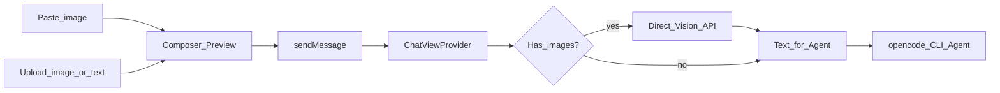

# AI 会话输入框：图片 + 文本类附件

## 目标体验

- **图片**：Ctrl/Cmd+V 粘贴，或上传；缩略图预览，可删除；发给 vision 模型
- **文本附件**：本地上传；文件名 chip 预览，可删除；内容按 **UTF-8 字符串** 拼进 prompt（不做复杂格式解析）
- 支持 `.log`、**无扩展名**、以及常见文本/代码扩展名；**非黑名单的其它扩展名也当文本**，乱码不管
- **上传入口有明确提示**（支持什么、不支持什么、大小限制）
- **高级/二进制扩展名黑名单**：命中则加入时直接拒绝
- 可「仅附件」「附件+文」发送；发送后清空预览
- **上传体积有硬限制**，超限拒绝并 toast
- 历史用户气泡：图片缩略图 + 文本附件 chip

本期明确不做：PDF/Office 等内容解析；不对文件内容做编码检测或乱码修复。

## 现状与关键缺口

统一发送流程（识图与 Agent 解耦）：

```
有图？ → 直连 Vision /chat/completions 识图成文
       → 再把「用户文字 + 识图结果」纯文本交给 opencode-ai/cli Agent
无图？ → 直接把用户文字交给 Agent
```

图片**不再**作为 file parts 进入 OpenCode，避免 Vision SSE/权限兜底干扰多步工具循环。

关键文件：

- UI：`src/media/chat-webview.js` + `src/chatViewProvider.ts`
- 识图：`src/visionRecognize.ts`（直连供应商，不经 CLI）
- Agent：`src/opencodeManager.ts` + `src/lib/@opencode-ai/sdk/index.mjs`
- 供应商：`src/providerStore.ts`（`modelSupportsVision` / 自动挑选 glm-4.6v 等）



## 分类规则、黑名单与体积限制

### 如何判定图片 vs 文本 vs 拒绝

加入预览前按扩展名 / mime 分流：

1. **图片**：`mime` 为 `image/*`，或扩展名为 `.png` `.jpg` `.jpeg` `.gif` `.webp` `.bmp` `.svg` → `kind: "image"`
2. **高级/二进制黑名单（直接拒绝）**：扩展名命中下列集合 → toast 拒绝，不加入预览  
   `.pdf` `.doc` `.docx` `.xls` `.xlsx` `.ppt` `.pptx` `.odt` `.ods` `.odp`  
   `.zip` `.rar` `.7z` `.tar` `.gz` `.bz2` `.xz` `.tgz`  
   `.exe` `.dll` `.so` `.dylib` `.bin` `.dmg` `.iso` `.msi` `.apk`  
   `.wasm` `.class` `.jar` `.war`  
   `.mp3` `.mp4` `.avi` `.mov` `.mkv` `.wav` `.flac` `.webm`  
   `.psd` `.ai` `.sketch` `.fig`  
   `.db` `.sqlite` `.sqlite3`
3. **其余全部当文本**：含 `.log`、无扩展名、以及未在黑名单中的任意扩展名 → `kind: "text"`，UTF-8 读入拼进 prompt；**不做乱码检测/修复**

只按**扩展名**做黑名单校验（取最后一个 `.` 后缀，大小写不敏感）；无扩展名一律放行当文本。不解析文件魔数。

### 上传窗口提示

附件按钮旁或点击上传时给出简短说明（可用 `title` + 首次/每次选文件前的轻量提示文案，或按钮 tooltip + toast 说明），内容要点：

- 支持：图片，以及文本/代码/日志等（含无扩展名）
- 不支持：PDF、Office、压缩包、音视频、可执行文件等
- 限制：最多 5 个；图片 ≤5MB；文本 ≤200KB

选文件对话框本身无法显示长说明，因此以 **按钮 tooltip / 预览区旁 hint 文案** 为主；拒绝黑名单或超限时用 toast 说清原因。

### 体积与数量硬限制

| 项 | 上限 | 超限行为 |
|----|------|----------|
| 附件总数（图+文本） | **5** | toast，不再加入 |
| 单张图片 | **5 MB** | toast「图片过大」，拒绝 |
| 单个文本文件 | **200 KB** | toast「文件过大」，拒绝 |
| 单次发送文本附件合计字符 | **约 100k 字符**（读入后校验） | toast，拒绝该文件 |

体积在 **加入预览前** 用 `File.size` 校验；文本再在读入后做字符数校验。

## 实现方案

### 1. Composer UI

改 `src/chatViewProvider.ts` 的 `renderHtml()` 与 `src/media/chat-webview.js`：

- `.composer-box` 内、textarea 上方 `#attachmentPreview`
- 工具栏「附件」按钮：带 **tooltip/hint**（支持范围与大小限制）+ `<input type="file" multiple>`
- **粘贴**：只处理剪贴板 `image/*`
- 加入流水线：数量校验 → **扩展名黑名单** → 体积校验 → 图片/文本分流 → 进预览
- 预览：图片 = 缩略图；文本 = 文件名 chip；均可单条删除
- `send()`：允许无字但有附件；payload `{ text, attachments: [...] }`；发送后清空

### 2. 协议与消息模型

统一附件，不再拆成两套字段：

```ts
type AttachmentKind = "image" | "text";

interface Attachment {
  id: string;
  kind: AttachmentKind;
  mime: string;
  name: string;
  path?: string;       // 落盘后
  dataUrl?: string;    // 仅图片传输瞬间 / 预览
  textContent?: string; // 仅文本：发送瞬间可带；落盘后由 host 读 path
}

// WebviewMessage
{ type: "sendMessage"; payload: { text: string; attachments?: Attachment[] } }

interface ChatMessage {
  role: "user" | "assistant";
  text: string;
  attachments?: Attachment[]; // 持久化只留 id/kind/mime/name/path
  toolCalls: ToolCallDisplay[];
  isStreaming: boolean;
}
```

### 3. 落盘与重发

- 目录：`~/.hxxcode/sessions/{sessionId}/attachments/{uuid}.{ext}`
- 会话 JSON 只存元数据，不长期塞大 base64 / 大段正文
- 历史：图片用 `asWebviewUri` 或临时 dataUrl；文本 chip 只显示文件名
- `retryLastMessage`：按 path 重读后重新组装 prompt

### 4. 喂给模型（两种附件两种路径）

`src/opencodeManager.ts` + SDK：

**图片** → OpenCode 2.0 `prompt.files`（vision）：

```ts
{
  prompt: {
    text: "用户问题",
    files: [{ uri: "data:image/png;base64,...", name: "a.png" }]
  }
}
```

内部仍用 `parts: [{type:'file', url, mime, filename}]` 组装，由 SDK 映射为上述 `files`。

**文本文件** → 读成字符串，拼进 text（不做格式解析）。推荐组装为额外 text part 或并入主 text，例如：

```text
用户输入原文

---
附件: notes.md
```
（文件 UTF-8 原文）
```
---
```

- 改 SDK：`POST /session/{id}/prompt` 使用 OpenCode 2.0 的 `{ prompt: { text, files: [{ uri, name }] } }`（不是标准 `parts`）
- 文本附件 **不依赖** OpenCode 对非图片 file 的处理，避免 mime/剥离不确定性

### 5. modalities（仅图片需要）

`src/providerStore.ts` 为每个模型写入：

```json
"modalities": { "input": ["text", "image"], "output": ["text"] }
```

文本附件走字符串，不依赖 image modality。

### 6. 边界

- 发送中禁用粘贴/上传/删除
- 非图片粘贴仍走默认文本粘贴
- 拖拽可作为后续增强（本期可不做）
- 黑名单扩展名：加入时直接拒绝；未在黑名单中的文件一律当文本，**乱码不管**
- 不对内容做编码探测、魔数检测或格式解析

## 主要改动文件

| 文件 | 改动 |
|------|------|
| `src/media/chat-webview.js` | 上传提示、黑名单、体积校验、粘贴图、双形态预览、payload |
| `src/chatViewProvider.ts` | HTML/CSS（含 hint）、协议、落盘、历史、retry |
| `src/opencodeManager.ts` | 图片 file parts + 文本字符串拼装 |
| `src/lib/@opencode-ai/sdk/index.mjs` + `.d.ts` | prompt 支持多 parts |
| `src/providerStore.ts` | modalities.image |
| `src/storage.ts` | 附件目录辅助（如需） |

## 验收标准

1. 粘贴截图 → 缩略图 → 可删 → 总数 ≤5
2. 上传 `.log` / 无扩展名 / 普通文本扩展名 → chip，按文本发送；内容乱码也不拦截
3. 上传 `.pdf` / `.docx` / `.zip` 等黑名单 → 加入前 toast 拒绝
4. 附件按钮有支持范围与大小限制提示
5. 超过 5MB 图片或 200KB 文本 → 加入前 toast 拒绝
6. 带图/带文本发送与历史回显正常；纯文本发送无回归
