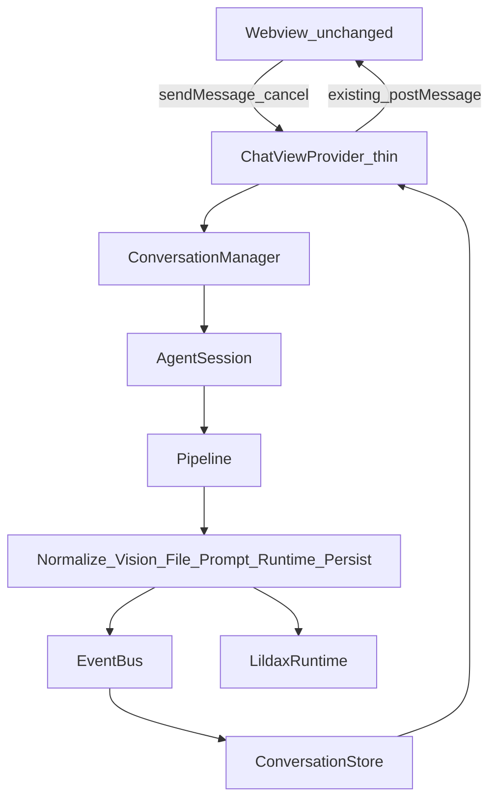

# Pipeline 会话业务重构（UI 不动）

> 状态：已落地（代码目录见下文）  
> 依据：[VSCode_AI_CodingAgent_总体架构设计_v1.md](../VSCode_AI_CodingAgent_总体架构设计_v1.md)

## 1. 目标与边界

- **做**：业务发送链路为 `ConversationManager → AgentSession → Pipeline Stages → EventBus → Store`。
- **不动**：`src/media/chat-webview.js` 布局与交互；现有 `state` / `messageChunk` / `toolStart` / `toolEnd` / `permissionRequest` 消息协议保持兼容。
- **下沉**：lildax 完成判定（`runAgentTurn` / message+wait）、权限、识图（`visionRecognize.ts`）、会话落盘——作为 Stage / Runtime 实现细节。同会话单飞由 `ConversationManager` 保证，**不是** FIFO 任务队列。

## 2. 目标架构



原则对齐总体设计 §11：Vision / Prompt / Runtime 是**同一 Job 的 Stage**，不是三个可独立入队的任务。  
会话级单飞由 `ConversationManager` 保证，**非** FIFO 任务队列。

## 3. 目录结构

```text
src/
 ├── conversation/
 │    ├── ConversationManager.ts
 │    ├── AgentSession.ts
 │    ├── ConversationStore.ts
 │    └── index.ts
 │
 ├── pipeline/
 │    ├── Pipeline.ts
 │    ├── PipelineContext.ts
 │    ├── index.ts
 │    └── stages/
 │           ├── NormalizeStage.ts
 │           ├── VisionStage.ts
 │           ├── FileStage.ts
 │           ├── PromptBuildStage.ts
 │           ├── RuntimeStage.ts
 │           ├── PersistStage.ts
 │           └── index.ts
 │
 ├── runtime/
 │    ├── LildaxRuntime.ts
 │    └── index.ts
 │
 ├── events/
 │    ├── EventBus.ts
 │    └── index.ts
 │
 ├── models/
 │    ├── ChatMessage.ts
 │    ├── MessagePart.ts
 │    └── index.ts
 │
 ├── chatViewProvider.ts          # 薄接入，协议不变
 ├── opencodeManager.ts           # 进程/权限/runAgentTurn
 ├── visionRecognize.ts
 └── media/chat-webview.js        # UI 不动
```

## 4. 核心模型与职责

### 4.1 MessagePart（统一输入）

```ts
type MessagePart = TextPart | ImagePart | FilePart
interface ChatMessage {
  id: string
  role: "user" | "assistant"
  parts: MessagePart[]
}
```

发送时由 `ChatViewProvider` 把现有 `text + attachments` **适配成** `MessagePart[]`（仅入口转换；业务内不再分「图片聊天 / 文本聊天」）。

### 4.2 PipelineContext

共享：`conversationId`、`message`、`prompt`、`visionTexts`、`fileContents`、`stream` 回调、`cancelToken`（AbortSignal）。

### 4.3 Stages（一次发送顺序执行）

| Stage | 行为 |
|-------|------|
| Normalize | 校验 parts、补 id、规范化 mime/路径 |
| Vision | 并行识图 → 写入 `visionTexts`（复用现有 vision API） |
| File | 读文本附件 → `fileContents` |
| PromptBuild | 拼统一 prompt（图片内容 / 附件内容 / 用户要求） |
| Runtime | 只调 `LildaxRuntime`，转发 token/tool/permission 事件到 EventBus |
| Persist | 写会话消息与 index（复用 storage） |

Stage 内发事件：`VisionStarted` / `VisionFinished` / `PromptBuilt` / `RuntimeStarted` / `RuntimeToken` / `RuntimeFinished` / `SessionFinished` / `SessionError`。

### 4.4 ConversationManager

- `send(conversationId, message)`：创建 `AgentSession`，跑 Pipeline。
- **同 conversation 单飞**：busy 时拒绝第二次发送并经 EventBus 报错（与当前 UI「流式时禁用输入」一致）。
- `cancel(conversationId)`：abort 当前 `AgentSession`，再走 Runtime 取消确认（复用 `confirmSessionIdle`）；失败则 `SessionError`。

### 4.5 ConversationStore

只存：Conversation / Messages / CurrentSession / StreamingText / Loading。  
`ChatViewProvider` 订阅 Store/EventBus，映射到现有 `postState` / `messageChunk` / `toolStart` / `toolEnd`（**协议不变**）。

### 4.6 LildaxRuntime

- `run(sessionId, prompt, signal, onEvent)` → `OpencodeManager.runAgentTurn`
- `confirmIdle(sessionId, signal)` → `OpencodeManager.confirmSessionIdle`

`OpencodeManager` 继续管进程启动、provider 配置、权限自动批准；**不再**被 UI 直接当发送编排器。

## 5. ChatViewProvider 薄接入

`handleSendMessage` / `cancelResponse`：

1. 组装 `MessagePart[]` → `ConversationManager.send`
2. 监听 EventBus：阶段进度写入现有 assistant 文本/tool 通道，不新增 webview 控件
3. 权限仍走现有 `requestPermissionInWebview`

`retryLastMessage`：再调 `ConversationManager.send`（同一套 Pipeline）。

## 6. 交互对齐（Claude Code 风格，已落地一期）

- 活动条：`Working…` / `Reading…` / `Editing…` / `Looking at image…`（不写进气泡）
- 工具步骤：Read / Edit / Bash / Grep 纵向列表，可点开文件
- 权限：Allow / Always allow / Deny；等待态进活动条
- 消息：Copy / Retry；空态 How can I help you today?
- 未做：Plan/Act 开关、行级 Diff 接受/拒绝、@ 提及、Todo 面板

## 7. 验证

1. `cd src && npm run build`
2. 纯文本发送 → 流式结束
3. 粘贴图片 → VisionStage → Agent 继续 → 正常结束
4. 文本附件发送成功
5. 运行中点取消 → UI 可再输入；取消确认失败有错误提示且可再次发送
