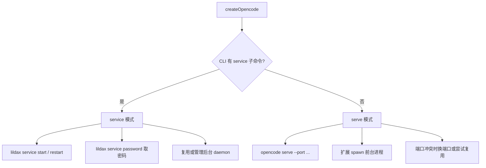

# OpenCode CLI 双模式说明（lildax / opencode）

HxxCode 通过 `@opencode-ai/sdk` 连接本地 OpenCode 服务。理解 **启动方式** 与 **API 协议** 两层分流，有助于排查 macOS / Windows 上的连接问题。

---

## 第一层：启动方式（SDK 自动选择）

扩展启动时，根据 CLI **是否支持 `service` 子命令** 自动分叉：



| 模式 | 典型命令 | 如何管理 server |
|------|----------|-----------------|
| **service 模式** | `lildax` | `service start / restart / password`，后台常驻 |
| **serve 模式** | `opencode`（无 `service` 时） | 扩展执行 `serve --port`，自行拉起进程 |

### 设置里的两个内置后端

配置位于 `~/.hxxcode/config.json` 的 `agentBackend.activeId`，对应 `src/agentBackend.ts` 中的预设：

| 设置项 | 命令 | 通常走的启动模式 |
|--------|------|------------------|
| OpenCode CLI（官方 @opencode-ai/cli） | `lildax` | **service 模式** |
| OpenCode CLI（opencode 命令别名） | `opencode` | **serve 模式** |

**设计意图**：二者来自同一个 npm 包 `@opencode-ai/cli`，只是 PATH 上的可执行文件名不同。

自动检测优先级：`lildax` → `opencode` → 无可用 CLI。

---

## 第二层：API 协议（HxxCode 只支持 v2）

无论走 service 还是 serve，**聊天、session、事件流等 HTTP 调用只认 OpenCode 2.0 预览版（lildax）API**：

| API 版本 | 健康检查 | Session 等路径 | HxxCode 支持 |
|----------|----------|----------------|--------------|
| **v2（lildax）** | `GET /api/health` | `/api/session/...` | ✅ 支持 |
| **标准 opencode** | `GET /global/health` | `/session/...` | ❌ 不支持 |

> 标准 opencode 访问 `/api/health` 会返回 SPA 的 HTML 页面，因此日志中可能出现 `Unexpected token '<'` 或「收到 HTML 响应」，并非网络故障，而是 **API 版本不匹配**。

SDK 会在连接时探测 API 版本；若仅检测到标准 opencode（`/global/health`），会提示安装 `lildax` 而非继续 silently 失败。

---

## 第三种情况：macOS 上常见的「假 opencode」

macOS 用户有时 PATH 上只有 `opencode`、没有 `lildax`，且该 `opencode` **并非** `@opencode-ai/cli` 的别名，而是独立安装的标准版 OpenCode（Homebrew、Go 二进制等）。

特征：

- `lildax` 命令不存在
- `opencode --help` 无 `service` 子命令 → 扩展走 **serve 模式**
- 4096 端口常被已有 `opencode` 进程占用（TUI 或上次 `serve` 残留）
- 健康检查 `/api/health` 返回 HTML；`/global/health` 返回 JSON

**这种情况目前无法被 HxxCode 直接使用**，需要安装官方 CLI 并使用 `lildax`。

---

## 推荐用法

1. 安装 OpenCode 2.0 预览版 CLI：

   ```bash
   npm install -g @opencode-ai/cli
   ```

2. 确认 `lildax` 可用：

   ```bash
   which lildax
   lildax --version
   lildax service --help
   ```

3. 在 HxxCode 设置中选择 **「OpenCode CLI（官方 @opencode-ai/cli）」**（使用 `lildax`）。

4. 若 4096 被旧进程占用，先释放端口：

   ```bash
   kill $(lsof -t -i :4096)
   ```

5. 验证 v2 API：

   ```bash
   lildax service start
   curl -s -u "opencode:$(lildax service password | tail -1)" http://127.0.0.1:4096/api/health
   ```

   期望返回 JSON，例如 `{"healthy":true,...}`，而不是 HTML。

---

## 常见问题排查

### npm 源错误导致 lildax 安装失败（易踩坑）

**现象**：HxxCode 报错「标准 opencode 与 lildax v2 不兼容」、`fetch fail`、健康检查收到 HTML 等，但本地明明执行过 `npm install -g @opencode-ai/cli`。

**根因**：npm registry 配置错误，`@opencode-ai/cli` 实际**没有装成功**，PATH 上只剩之前已有的 **opencode 1.x**（标准版），没有 `lildax`。

因果链：

```
npm 源错误
  → @opencode-ai/cli (lildax) 下载/安装失败
  → PATH 上只有 opencode 1.x
  → 扩展走 serve 模式 + 标准 API (/global/health)
  → HxxCode 报错 / fetch 失败
```

**排查**：

```bash
# 1. 检查当前 npm 源
npm config get registry
# 官方源应为：https://registry.npmjs.org/

# 2. 确认 lildax 是否真的装上了
which lildax          # 应有输出，不能是 "not found"
lildax --version
lildax service --help # 应有 service 子命令
```

**修复**：

```bash
# 切换到官方 npm 源（或确保所用镜像已同步 @opencode-ai/cli）
npm config set registry https://registry.npmjs.org/

# 重新安装
npm install -g @opencode-ai/cli

# 再次验证
which lildax && lildax --version
```

若使用国内镜像，需确认该镜像**已同步** `@opencode-ai/cli` 包；同步滞后或缺失时，同样会导致安装失败，表现与源配错一致。

**安装成功后**：在 HxxCode 设置中选择 **「OpenCode CLI（官方 @opencode-ai/cli）」**，必要时释放 4096 端口：

```bash
kill $(lsof -t -i :4096)
```

### 4096 端口被旧 opencode 占用

```bash
lsof -i :4096
kill $(lsof -t -i :4096)
```

若占用进程是残留的标准版 `opencode`，清掉后配合正确安装的 `lildax` 即可恢复正常。

---

## 相关代码位置

| 模块 | 路径 | 职责 |
|------|------|------|
| Agent 后端预设 | `src/agentBackend.ts` | `lildax` / `opencode` 命令与设置项 |
| SDK 双模式适配 | `src/lib/@opencode-ai/sdk/index.mjs` | `ensureService` / `ensureServeProcess`、API 探测 |
| 扩展激活 | `src/extension.ts` | CLI 自动检测与仅有标准 opencode 时的警告 |
| 连接管理 | `src/opencodeManager.ts` | 写配置、注入 env、持有 SDK client |

---

## 总结

| 理解 | 实际情况 |
|------|----------|
| lildax 和 opencode 走不同启动路线 | ✅ service 模式 vs serve 模式 |
| 两条线都能完整使用 HxxCode | ⚠️ 仅 **lildax v2 API**（`/api/*`）可跑通全流程 |
| 设置里选「opencode 命令别名」即可 | ❌ 若 PATH 上是标准 opencode，仍会失败 |

若未来需要支持标准 opencode API（`/global/health`、`/session/:id/message` 等），需在 SDK 中单独实现一套协议适配，当前未实现。
